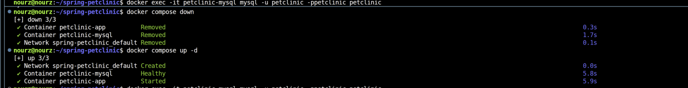
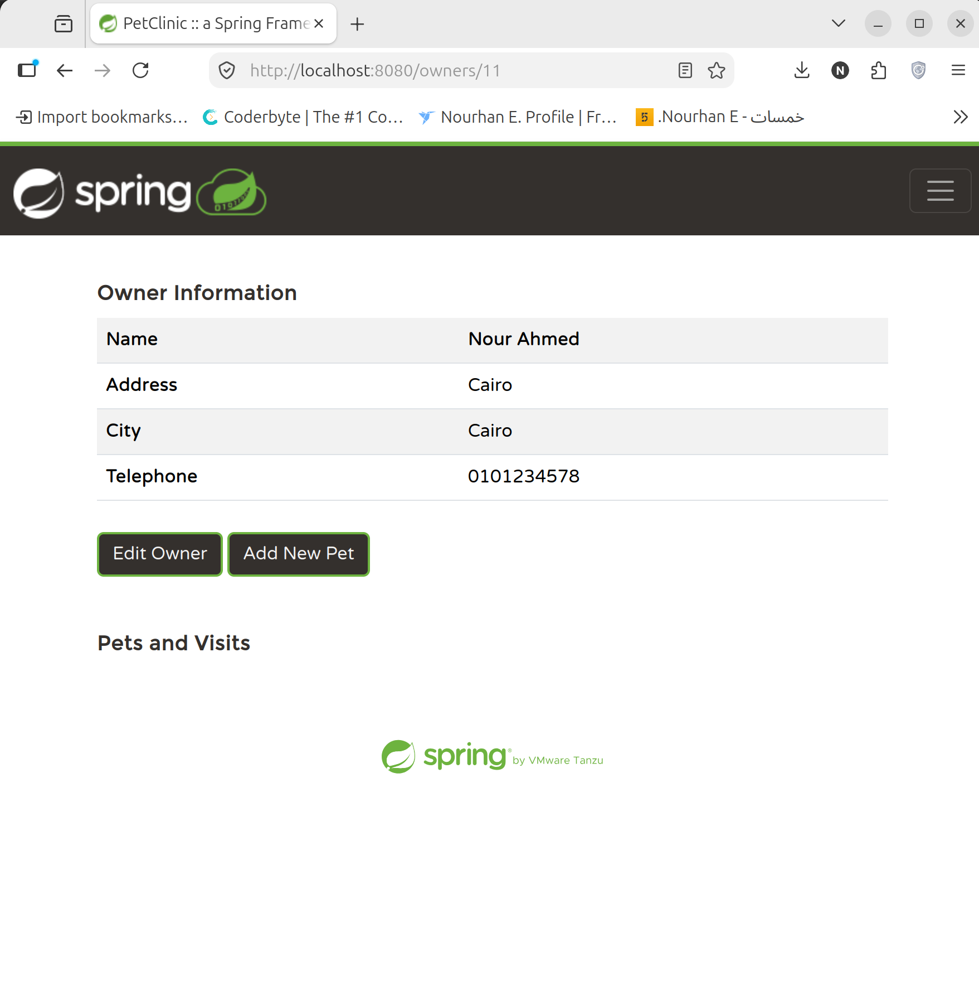
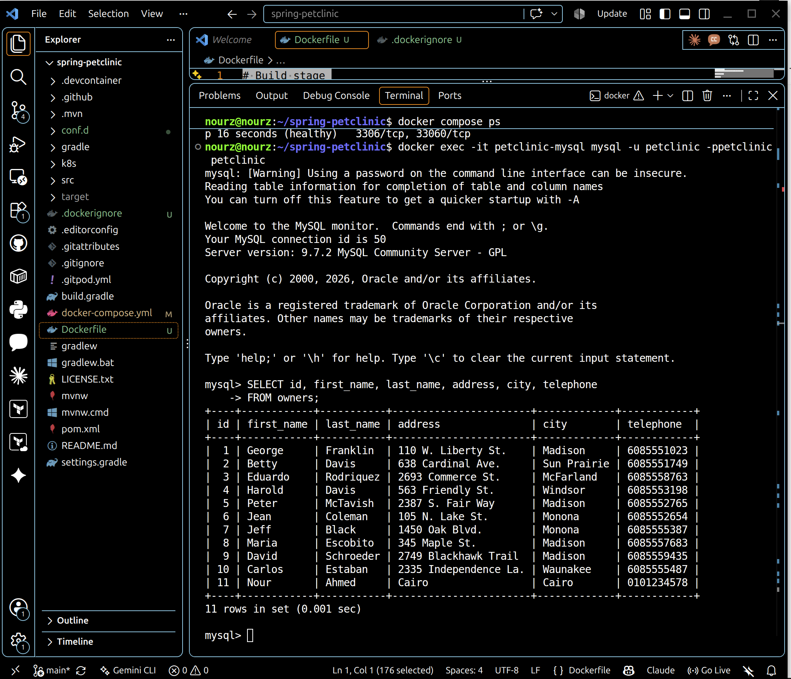

# Spring Petclinic — Dockerized

A Dockerized development and runtime environment for the [Spring Petclinic](https://github.com/spring-projects/spring-petclinic) application.

This repository is based on the original Spring Petclinic project, with an additional **Docker and containerization layer** for running the application together with a persistent MySQL database.

---

## Overview

[Spring Petclinic](https://github.com/spring-projects/spring-petclinic) is a sample Spring Boot application built with Java and Maven.

This repository focuses on extending the application with a containerized environment that provides:

* A multi-stage Docker build for the Spring Boot application
* A lightweight Java runtime container
* MySQL running as a separate container
* Docker Compose orchestration
* Container-to-container communication through a Docker network
* Health checks and service startup dependencies
* Persistent MySQL storage using Docker volumes
* Verification of application data directly from the database

The original application code remains the foundation of the project; the main focus here is the **DevOps and containerization setup around it**.

---

## Architecture

The environment consists of two main services:

```text
                    Docker Compose
                         │
             ┌───────────┴───────────┐
             │                       │
             ▼                       ▼
      ┌──────────────┐       ┌──────────────┐
      │ Petclinic App│──────▶│    MySQL     │
      │   :8080      │       │    :3306     │
      └──────────────┘       └──────┬───────┘
                                    │
                                    ▼
                              mysql_data
                              Docker Volume
```

The application communicates with MySQL through the Docker Compose network using the MySQL service name:

```text
jdbc:mysql://mysql:3306/petclinic
```

---

## Containerization

### Multi-Stage Docker Build

The application is packaged using a multi-stage Dockerfile.

The first stage is responsible for building the Spring Boot application:

```dockerfile
FROM eclipse-temurin:17-jdk AS builder

WORKDIR /app

COPY . .

RUN ./mvnw clean package -DskipTests
```

The second stage contains only the runtime environment and the generated application JAR:

```dockerfile
FROM eclipse-temurin:17-jre

WORKDIR /app

COPY --from=builder /app/target/*.jar app.jar

EXPOSE 8080

ENTRYPOINT ["java", "-jar", "app.jar"]
```

This separates the build environment from the runtime environment and avoids including the full JDK and build artifacts in the final runtime image.

---

## Docker Compose Environment

The application and database are managed together using Docker Compose.

### Application

The `app` service:

* Builds the application image from the Dockerfile
* Exposes port `8080`
* Uses the MySQL Spring profile
* Connects to the MySQL container through the Compose network

```yaml
app:
  build:
    context: .
    dockerfile: Dockerfile
  ports:
    - "8080:8080"
  environment:
    SPRING_PROFILES_ACTIVE: mysql
    MYSQL_URL: jdbc:mysql://mysql:3306/petclinic
    MYSQL_USER: petclinic
    MYSQL_PASS: petclinic
```

### MySQL

The `mysql` service uses MySQL 9.7 and stores its data in a named Docker volume:

```yaml
mysql:
  image: mysql:9.7
  environment:
    MYSQL_USER: petclinic
    MYSQL_PASSWORD: petclinic
    MYSQL_DATABASE: petclinic
  volumes:
    - mysql_data:/var/lib/mysql
```

A health check is also configured so the application starts after MySQL becomes ready.

---

## Application–Database Communication

Inside Docker Compose, containers communicate using service names rather than `localhost`.

Therefore, the application uses:

```text
jdbc:mysql://mysql:3306/petclinic
```

instead of:

```text
jdbc:mysql://localhost/petclinic
```

Here, `mysql` is the name of the MySQL Compose service and Docker's internal DNS resolves it to the MySQL container.

---

## Running the Environment

### Prerequisites

* Docker
* Docker Compose
* Git

### Build the application image

```bash
docker compose build
```

### Start the environment

```bash
docker compose up -d
```

### Check running containers

```bash
docker compose ps
```

Expected services:

```text
petclinic-app
petclinic-mysql
```

The MySQL container should report a healthy status.

### Open the application

Visit:

```text
http://localhost:8080
```

---

## Database Verification

Data entered through the Petclinic web interface can be verified directly from the MySQL container.

Connect to MySQL:

```bash
docker exec -it petclinic-mysql mysql -u petclinic -ppetclinic petclinic
```

Check the available tables:

```sql
SHOW TABLES;
```

For example, to verify owners:

```sql
SELECT id, first_name, last_name, address, city, telephone
FROM owners;
```

This provides a direct verification that data submitted through the application is stored in the MySQL database.

### Data Flow

```text
Petclinic UI
     │
     ▼
Spring Boot Application
     │
     ▼
Docker Network
     │
     ▼
MySQL Container
     │
     ▼
mysql_data Volume
```

---

## Persistent Database Storage

The MySQL database uses a named Docker volume:

```yaml
volumes:
  mysql_data:
```

This allows database data to survive normal container removal.

### Stop and remove containers

```bash
docker compose down
```

The containers are removed, but the named volume remains.

Starting the environment again:

```bash
docker compose up -d
```

restores the database with its existing data.

### Remove containers and the database volume

```bash
docker compose down -v
```

The `-v` option removes the Compose-managed volume, which also removes the persisted MySQL data.

This demonstrates the difference between **container lifecycle** and **persistent storage lifecycle**.

---

## Project Structure

Relevant Docker and configuration files added or used for the containerized environment:

```text
spring-petclinic/
│
├── Dockerfile
├── docker-compose.yml
├── .dockerignore
├── conf.d/
│   └── my.cnf
│
├── src/
│   └── ...
│
├── pom.xml
└── README.md
```

The original Spring Petclinic source structure is retained, while the Docker-related files provide the containerized environment.

---

## Technologies

| Technology     | Purpose                       |
| -------------- | ----------------------------- |
| Java 17        | Application runtime           |
| Spring Boot    | Backend application           |
| Maven          | Build and packaging           |
| MySQL 9.7      | Relational database           |
| Docker         | Containerization              |
| Docker Compose | Multi-container orchestration |
| Docker Volumes | Persistent database storage   |

---

## Screenshots

### Docker Compose Services



### Data Added Through the UI



### Database Verification



---

## What This Project Covers

This project provides practical experience with:

* Docker image creation
* Multi-stage Docker builds
* Docker Compose
* Container networking
* Service discovery
* Environment-based application configuration
* Database containerization
* Health checks
* Docker volumes
* Persistent storage
* Application-to-database communication
* Container lifecycle management

---

## Original Project

This repository is based on the **Spring Petclinic Sample Application** by the Spring community.

The original application and its source code are maintained by their respective authors. This repository focuses on the Dockerization and DevOps work added around the application.

## License

The original Spring Petclinic project is released under the **Apache License 2.0**.

For the original project's license and contribution information, please refer to the upstream Spring Petclinic repository.
