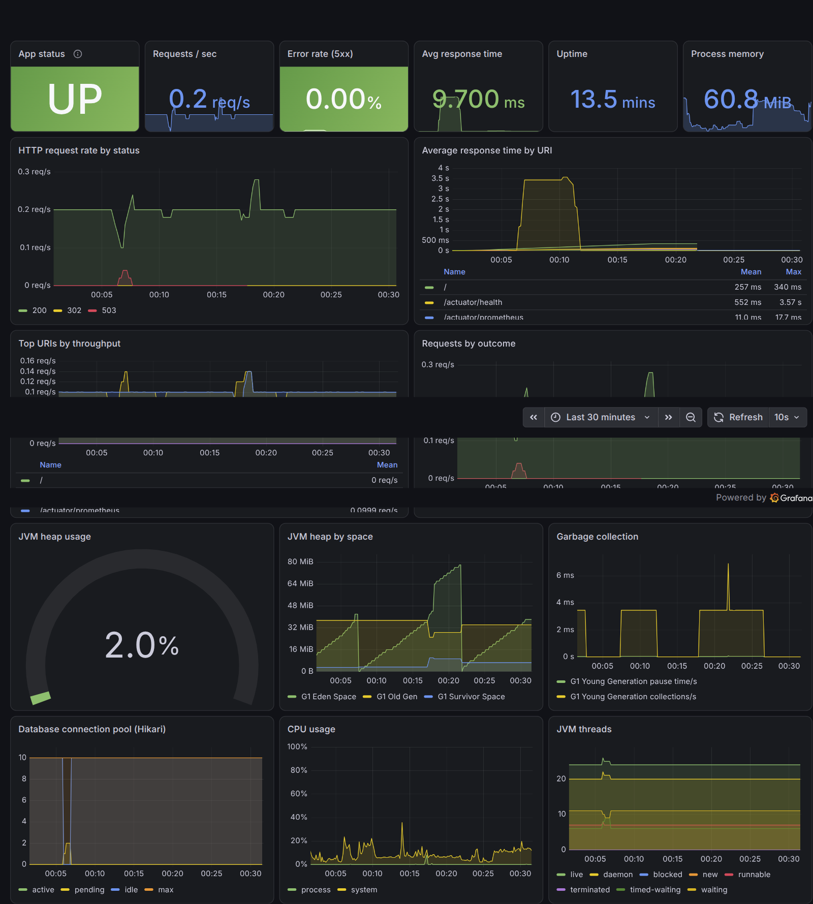
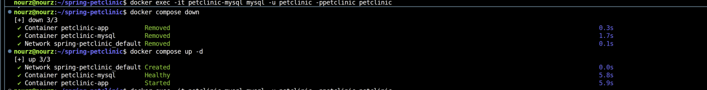
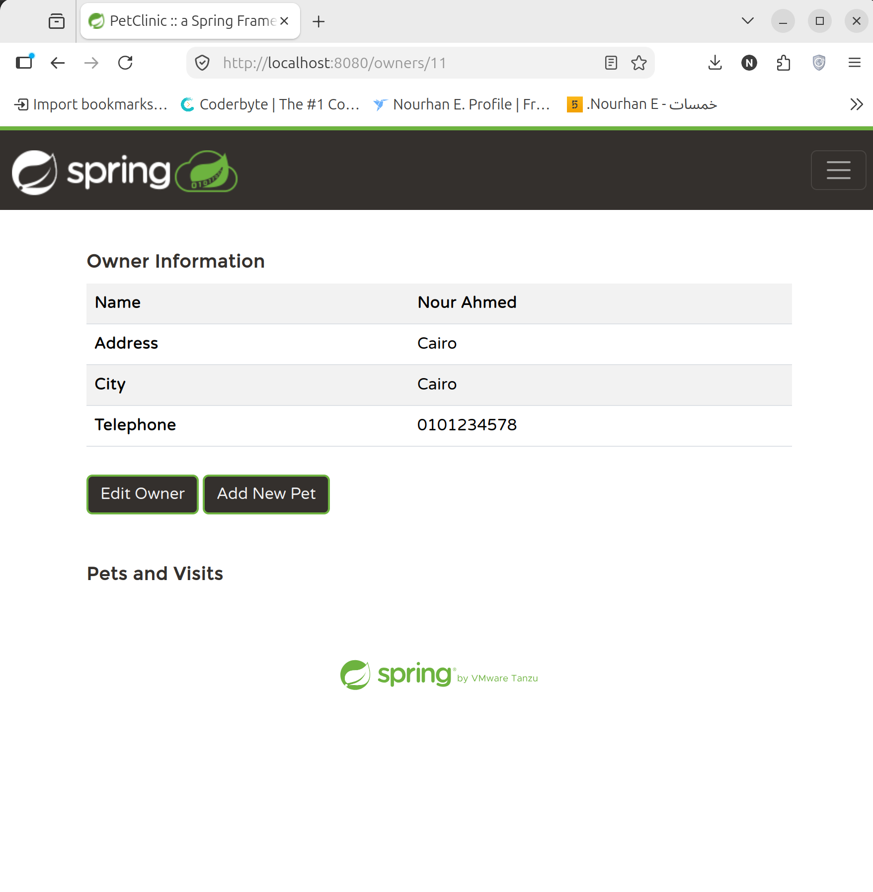
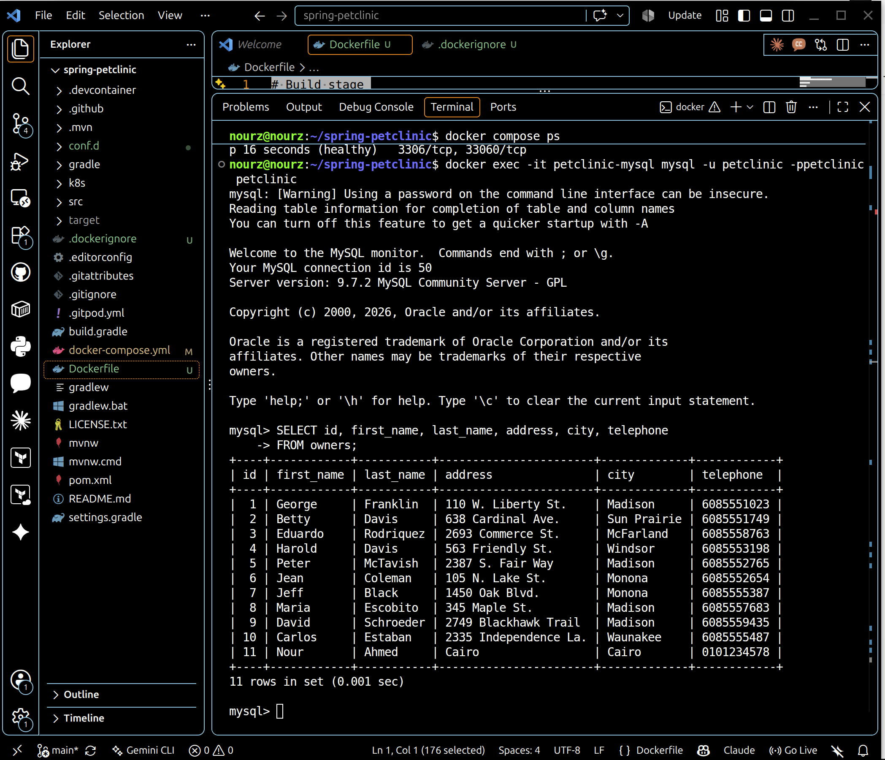

# Spring Petclinic — Dockerized

A Dockerized development and runtime environment for the [Spring Petclinic](https://github.com/spring-projects/spring-petclinic) application, wrapped in a **7-stage GitHub Actions CI/CD pipeline** with quality scanning, a private Docker registry and a Prometheus/Grafana monitoring stack.

This repository is based on the original Spring Petclinic project, with an additional **Docker, CI/CD and observability layer** around it. The application runs beside MySQL, Prometheus, Grafana and Nexus in Docker Compose, and every push to `main` is built, tested, scanned, published to Nexus, deployed and smoke-tested automatically.

---

## Overview

[Spring Petclinic](https://github.com/spring-projects/spring-petclinic) is a sample Spring Boot application built with Java and Maven.

This repository focuses on extending the application with a containerized environment that provides:

* A multi-stage Docker build for the Spring Boot application
* A lightweight Java runtime container
* MySQL running as a separate container
* Docker Compose orchestration
* Container-to-container communication through a Docker network
* Health checks and service startup dependencies
* Persistent MySQL storage using Docker volumes
* Verification of application data directly from the database
* A **7-stage GitHub Actions pipeline** on a self-hosted runner (build → scan → publish → deploy → verify)
* **SonarQube** static analysis and **Trivy** vulnerability scanning, configured as advisory stages
* A **Nexus** private Docker registry that stores every image tagged with its commit SHA
* **Prometheus + Grafana** monitoring with a pre-built, auto-provisioned dashboard
* **14 automated smoke tests** that validate the deployed stack after every run

The original application code remains the foundation of the project; the main focus here is the **DevOps, CI/CD and monitoring setup around it**.

---

## Architecture

The environment runs a small observability stack and a private registry next to the application:

```text
                          Docker Compose
                               │
     ┌────────────┬────────────┼────────────┬─────────────┐
     ▼            ▼            ▼            ▼             ▼
┌──────────┐ ┌─────────┐ ┌───────────┐ ┌─────────┐ ┌────────────┐
│ Petclinic│ │  MySQL  │ │ Prometheus│ │ Grafana │ │   Nexus    │
│  :8080   │ │  :3306  │ │   :9090   │ │  :3000  │ │ :8081/:8082│
└────┬─────┘ └────┬────┘ └─────┬─────┘ └────┬────┘ └─────┬──────┘
     │            │            │            │            │
     │            ▼            │            ▼            │
     │       mysql_data        │       grafana_data      │
     │            │            │            │            │
     │            │      ▲ prometheus_data │            │
     │            │      │            │            │
     │ GET /actuator/     │ query            │ docker push / pull
     │ prometheus (10 s)  │            │ (SHA-tagged images)
     └────────────────────┴──────────────────┴────────────┘
```

* **Petclinic App** — Spring Boot application, port `8080`
* **MySQL** — the application database, persisted in the `mysql_data` named volume
* **Prometheus** — scrapes `/actuator/prometheus` from the app every 10 seconds
* **Grafana** — dashboards on top of Prometheus, fully auto-provisioned from this repository
* **Nexus** — a private Docker registry (`:8081` web UI, `:8082` Docker HTTP connector)

A `postgres` service also exists, but only behind the `postgres` Compose profile — it is started
by the integration tests in stage 1 of the pipeline.

The application communicates with MySQL through the Docker Compose network using the MySQL service name:

```text
jdbc:mysql://mysql:3306/petclinic
```

---

## Containerization

### Multi-Stage Docker Build

The application is packaged using a multi-stage Dockerfile.

The first stage is responsible for building the Spring Boot application:

```dockerfile
FROM eclipse-temurin:17-jdk AS builder

WORKDIR /app

COPY . .

RUN ./mvnw clean package -DskipTests
```

The second stage contains only the runtime environment and the generated application JAR:

```dockerfile
FROM eclipse-temurin:17-jre

WORKDIR /app

COPY --from=builder /app/target/*.jar app.jar

EXPOSE 8080

ENTRYPOINT ["java", "-jar", "app.jar"]
```

This separates the build environment from the runtime environment and avoids including the full JDK and build artifacts in the final runtime image.

---

## Docker Compose Environment

The application and database are managed together using Docker Compose.

### Application

The `app` service:

* Builds the application image from the Dockerfile
* Exposes port `8080`
* Uses the MySQL Spring profile
* Connects to the MySQL container through the Compose network

```yaml
app:
  build:
    context: .
    dockerfile: Dockerfile
  ports:
    - "8080:8080"
  environment:
    SPRING_PROFILES_ACTIVE: mysql
    MYSQL_URL: jdbc:mysql://mysql:3306/petclinic
    MYSQL_USER: petclinic
    MYSQL_PASS: petclinic
```

### MySQL

The `mysql` service uses MySQL 9.7 and stores its data in a named Docker volume:

```yaml
mysql:
  image: mysql:9.7
  environment:
    MYSQL_USER: petclinic
    MYSQL_PASSWORD: petclinic
    MYSQL_DATABASE: petclinic
  volumes:
    - mysql_data:/var/lib/mysql
```

A health check is also configured so the application starts after MySQL becomes ready.

### Monitoring and registry services

The same Compose file also starts the services used by the pipeline:

| Service    | Port           | Purpose                                              | Data volume      |
| ---------- | -------------- | ---------------------------------------------------- | ---------------- |
| `app`      | `8080`         | Spring Boot application                              | — (redeployed)   |
| `mysql`    | *(no host port)* | Application database, reached as `mysql:3306`      | `mysql_data`     |
| `postgres` | `5432`         | Test database — profile `postgres`, used in stage 1  | `postgres_data`  |
| `prometheus` | `9090`       | Scrapes `/actuator/prometheus` every 10 s            | `prometheus_data`|
| `grafana`  | `3000`         | Dashboards, datasource + dashboard auto-provisioned  | `grafana_data`   |
| `nexus`    | `8081` / `8082` | Nexus repository manager / Docker registry          | `nexus-data`     |

Start everything with:

```bash
docker compose up -d
```

Start only the application and its database (what a developer usually needs):

```bash
docker compose up -d app mysql
```

> **Note on `mysql`:** the service deliberately publishes **no host port**. Stage 1 of the
> pipeline stops it while `mvn verify` runs, because Spring Boot's Docker Compose test
> integration would otherwise try to use it as a datasource instead of PostgreSQL.

---

## Application–Database Communication

Inside Docker Compose, containers communicate using service names rather than `localhost`.

Therefore, the application uses:

```text
jdbc:mysql://mysql:3306/petclinic
```

instead of:

```text
jdbc:mysql://localhost/petclinic
```

Here, `mysql` is the name of the MySQL Compose service and Docker's internal DNS resolves it to the MySQL container.

---

## Running the Environment

### Prerequisites

* Docker
* Docker Compose
* Git

### Build the application image

```bash
docker compose build
```

### Start the environment

```bash
docker compose up -d
```

### Check running containers

```bash
docker compose ps
```

Expected services:

```text
petclinic-app
petclinic-mysql
petclinic-prometheus
petclinic-grafana
nexus
```

`petclinic-app` and `petclinic-mysql` should report a **healthy** status (MySQL is healthy
once its init scripts have finished; the app becomes healthy once `/actuator/health` answers
`UP`). `postgres` only appears when the `postgres` profile is enabled.

### Open the application

| What                | URL                                      |
| ------------------- | ---------------------------------------- |
| Application         | <http://localhost:8080>                  |
| Prometheus          | <http://localhost:9090>                  |
| Grafana             | <http://localhost:3000> (`admin`/`admin`) |
| Grafana dashboard   | <http://localhost:3000/d/petclinic-overview/spring-petclinic-overview> |
| Nexus UI            | <http://localhost:8081>                  |
| Nexus Docker registry | `localhost:8082`                       |
| SonarQube           | <http://localhost:9000> (`admin`/`admin`) |

---

## Database Verification

Data entered through the Petclinic web interface can be verified directly from the MySQL container.

Connect to MySQL:

```bash
docker exec -it petclinic-mysql mysql -u petclinic -ppetclinic petclinic
```

Check the available tables:

```sql
SHOW TABLES;
```

For example, to verify owners:

```sql
SELECT id, first_name, last_name, address, city, telephone
FROM owners;
```

This provides a direct verification that data submitted through the application is stored in the MySQL database.

### Data Flow

```text
Petclinic UI
     │
     ▼
Spring Boot Application
     │
     ▼
Docker Network
     │
     ▼
MySQL Container
     │
     ▼
mysql_data Volume
```

---

## Persistent Database Storage

The MySQL database uses a named Docker volume:

```yaml
volumes:
  mysql_data:
```

This allows database data to survive normal container removal.

### Stop and remove containers

```bash
docker compose down
```

The containers are removed, but the named volume remains.

Starting the environment again:

```bash
docker compose up -d
```

restores the database with its existing data.

### Remove containers and the database volume

```bash
docker compose down -v
```

The `-v` option removes the Compose-managed volume, which also removes the persisted MySQL data.

This demonstrates the difference between **container lifecycle** and **persistent storage lifecycle**.

---

## Monitoring — Prometheus & Grafana

Spring Boot exposes Micrometer metrics at `/actuator/prometheus`, thanks to
`spring-boot-starter-actuator` plus `io.micrometer:micrometer-registry-prometheus`. The
`prometheus.yml` in this repository scrapes that endpoint every 10 seconds:

```yaml
scrape_configs:
  - job_name: 'spring-petclinic'
    metrics_path: '/actuator/prometheus'
    scrape_interval: 10s
    static_configs:
      - targets: ['app:8080']
```

Grafana is configured entirely from files committed here, so **nothing has to be imported or
clicked together by hand**:

| File                                            | What it creates                                     |
| ----------------------------------------------- | --------------------------------------------------- |
| `grafana/provisioning/datasources/prometheus.yml` | the `Prometheus` datasource (`uid: prometheus`)     |
| `grafana/provisioning/dashboards/petclinic.yml`   | the dashboard provider (folder `PetClinic`)         |
| `grafana/dashboards/petclinic.json`              | the **Spring PetClinic Overview** dashboard (16 panels) |

### How to show the dashboard

1. Make sure the monitoring services are running:

   ```bash
   docker compose up -d prometheus grafana
   ```

2. Open **<http://localhost:3000>** and sign in with **`admin` / `admin`**
   (Grafana asks you to change the password on first login — you can skip it).

3. Open the pre-provisioned dashboard directly:

   > **<http://localhost:3000/d/petclinic-overview/spring-petclinic-overview>**

   or navigate to it manually: **Dashboards → PetClinic → Spring PetClinic Overview**



The dashboard shows, live:

* Application status, requests/sec, 5xx error rate, average response time, uptime and process memory
* HTTP request rate by status code, average latency per URI, top URIs by throughput, requests by outcome
* JVM heap usage (gauge plus per-space), garbage-collection pause time and frequency
* HikariCP connection pool (active / idle / pending / max), process CPU and JVM threads

The dashboard's stable UID is `petclinic-overview`, so the link keeps working after a Grafana
reset. Prometheus is on <http://localhost:9090> if you want to write raw queries instead.

---

## CI/CD Pipeline — GitHub Actions

`.github/workflows/deploy.yml` defines a **strictly sequential 7-stage pipeline** running on a
**self-hosted runner**, which lets it talk to this machine's Docker daemon, Nexus and SonarQube
over `localhost`.

| # | Stage               | Job                  | What it does                                                                     |
| - | ------------------- | -------------------- | -------------------------------------------------------------------------------- |
| 1 | Build & Test        | `build-and-test`     | `mvn clean verify` (76 tests) then `docker build` → `spring-petclinic:latest`     |
| 2 | SonarQube Analysis  | `sonarqube-analysis` | Quality-gate report for the `spring-petclinic` project *(advisory)*               |
| 3 | Trivy Scan          | `trivy-scan`         | CVE scan of the image and filesystem *(advisory)*                                 |
| 4 | Push to Nexus       | `nexus-push`         | Tags the image with the commit SHA and pushes it to `localhost:8082`             |
| 5 | Deploy              | `deploy-local`       | Pulls that SHA back from Nexus and runs `docker compose up -d`                    |
| 6 | Monitoring          | `monitoring`         | Waits until Prometheus reports the `spring-petclinic` target as `up`              |
| 7 | Smoke Tests         | `smoke-tests`        | 14 automated checks against the running stack                                    |

### How the stages are connected

```text
 1 Build & Test  ──▶  2 SonarQube  ──▶  3 Trivy  ──▶  4 Nexus push  ──▶  5 Deploy  ──▶  6 Monitoring  ──▶  7 Smoke tests
   blocking           advisory          advisory         blocking          blocking        blocking            blocking
```

Every job declares `needs:` on the job before it, so a stage never starts until the previous
one has finished — there are **no parallel jobs**, the pipeline is fully ordered.

**Blocking vs. advisory.** Stages 2 and 3 are advisory *by design*: their scan steps use
`continue-on-error: true`, and Trivy is additionally invoked with `exit-code: '0'`. They emit
`::warning::` annotations plus a Job Summary report, but neither a SonarQube quality gate nor a
CVE can ever fail the build. Stages 1, 4, 5, 6 and 7 are blocking — a genuine build, push,
deploy or smoke-test failure stops the run.

### Required GitHub Secrets

Configure them under **Settings → Secrets and variables → Actions**:

| Secret            | Value                                                         |
| ----------------- | ------------------------------------------------------------- |
| `SONAR_HOST_URL`  | `http://localhost:9000`                                       |
| `SONAR_TOKEN`     | a SonarQube analysis token (SonarQube → My Account → Tokens)  |
| `NEXUS_USER`      | the Nexus administrator user                                  |
| `NEXUS_PASSWORD`  | the Nexus administrator password                              |

Missing `SONAR_HOST_URL` / `SONAR_TOKEN` makes stage 2 skip itself with a warning, so the
pipeline keeps going. Missing `NEXUS_USER` / `NEXUS_PASSWORD` makes stage 4 fail fast with a
clear error, and stage 5 then falls back to the locally built image with a warning.

### The self-hosted runner

The runner is registered for this repository with the labels `self-hosted, Linux, X64` and
lives outside the repository, under the user's home directory. Because it executes on the same
machine as Docker, Nexus and SonarQube, the pipeline can address them as `localhost` — that is
why the registry is `localhost:8082`, why SonarQube is `http://localhost:9000`, and why the
runner never needs containerised service discovery.

Repository setup in detail (Nexus `docker_hosted` repository and its HTTP connector, the
SonarQube token, runner registration) is documented in
[`docs/CI-CD-SETUP.md`](docs/CI-CD-SETUP.md).

### Smoke tests (stage 7)

`scripts/smoke-test.sh` is the gate of stage 7. It runs **14 checks in 6 groups** and exits
non-zero if any of them fails:

1. **Application availability** — homepage, owner search, new owner form, vets page
2. **Actuator / readiness** — `/actuator/health` responds and reports `UP`
3. **Monitoring endpoints** — `/actuator/prometheus` responds and HTTP metrics are recorded
4. **Database round-trip** — creates an owner over HTTP, then reads it back from the database
5. **Prometheus** — server is ready and the `spring-petclinic` target is `up`
6. **Grafana** — API is healthy and the Prometheus datasource is provisioned

---

## Project Structure

Relevant Docker and configuration files added or used for the containerized environment:

```text
spring-petclinic/
│
├── Dockerfile                        multi-stage build (JDK build → JRE runtime)
├── docker-compose.yml                app + mysql + prometheus + grafana + nexus
├── prometheus.yml                    scrape config for /actuator/prometheus
├── .dockerignore
├── pom.xml
│
├── .github/
│   └── workflows/
│       └── deploy.yml                the 7-stage CI/CD pipeline
│
├── grafana/
│   ├── dashboards/
│   │   └── petclinic.json            "Spring PetClinic Overview" dashboard (16 panels)
│   └── provisioning/
│       ├── dashboards/petclinic.yml  dashboard provider (folder: PetClinic)
│       └── datasources/prometheus.yml  Prometheus datasource
│
├── scripts/
│   └── smoke-test.sh                 stage 7 — 14 automated checks
│
├── docs/
│   └── CI-CD-SETUP.md                runner, Nexus and SonarQube setup guide
│
├── screenshots/                      UI, Compose and dashboard screenshots
├── conf.d/
│   └── my.cnf
│
├── src/                              original Spring Petclinic source
│   └── ...
│
└── README.md
```

The original Spring Petclinic source structure is retained, while the Docker, CI/CD and
monitoring files provide the DevOps environment around it.

---

## Technologies

| Technology        | Purpose                                        |
| ----------------- | ---------------------------------------------- |
| Java 17           | Application runtime                            |
| Spring Boot       | Backend application (with Actuator)            |
| Micrometer        | Metrics that feed `/actuator/prometheus`       |
| Maven             | Build and packaging                            |
| MySQL 9.7         | Relational database                            |
| PostgreSQL 17     | Test database (profile `postgres`)             |
| Docker            | Containerization                               |
| Docker Compose    | Multi-container orchestration                  |
| Docker Volumes    | Persistent database and metrics storage        |
| GitHub Actions    | 7-stage CI/CD pipeline                         |
| Self-hosted runner | Executes the pipeline on the local machine    |
| SonarQube         | Static analysis and quality gate (advisory)    |
| Trivy             | Container / filesystem CVE scanning (advisory) |
| Sonatype Nexus    | Private Docker registry (`docker_hosted`)      |
| Prometheus        | Time-series metrics scraping                   |
| Grafana           | Dashboards and visualization                   |
| Shell (Bash)      | Automated smoke tests                          |

---

## Screenshots

### Docker Compose Services



### Data Added Through the UI



### Database Verification



### Grafana Dashboard


---

## What This Project Covers

This project provides practical experience with:

* Docker image creation
* Multi-stage Docker builds
* Docker Compose
* Container networking
* Service discovery
* Environment-based application configuration
* Database containerization
* Health checks
* Docker volumes
* Persistent storage
* Application-to-database communication
* Container lifecycle management
* GitHub Actions workflow design (jobs, `needs:` dependency chains, `continue-on-error`)
* Self-hosted runner operation
* Continuous integration: building and testing on every push
* Static analysis with SonarQube and CVE scanning with Trivy
* Publishing images to a private Docker registry (Nexus) tagged by commit SHA
* Continuous deployment with Docker Compose
* Metrics exposition with Micrometer and scraping with Prometheus
* Dashboard provisioning as code with Grafana
* End-to-end smoke testing of a deployed stack

---

## Original Project

This repository is based on the **Spring Petclinic Sample Application** by the Spring community.

The original application and its source code are maintained by their respective authors. This repository focuses on the Dockerization and DevOps work added around the application.

## License

The original Spring Petclinic project is released under the **Apache License 2.0**.

For the original project's license and contribution information, please refer to the upstream Spring Petclinic repository.
